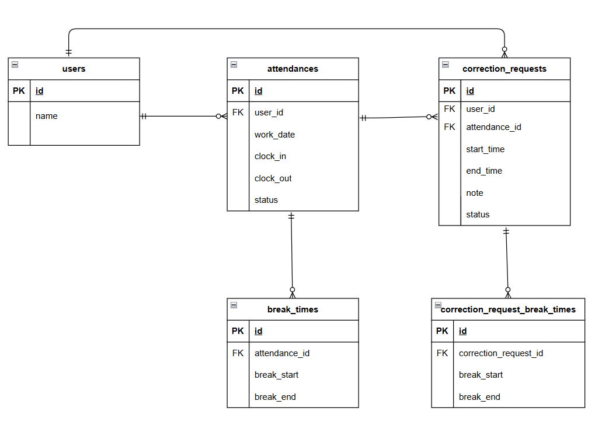

# 勤怠管理アプリ

## プロジェクト概要
ある企業が開発した独自の勤怠管理アプリです  
一般ユーザーは出退勤や休憩時間の記録、勤怠修正申請を行うことができ、管理者は勤怠情報や修正申請の確認・承認を行うことができます

---

## 使用技術（実行環境）
- PHP 8.1.33
- Laravel 8.83.8
- MySQL 8.0.x
- Docker / Docker Compose
- MailHog
- GitHub

---

## 主な機能
- 出勤・退勤打刻
- 休憩開始・終了
- 勤怠一覧
- 修正申請
- 管理者による承認
- 管理者による勤怠管理
- ダミーデータ作成

---

## 環境構築

### Dockerビルド
1. `git clone git@github.com:o-emi/attendance-management-app.git`
2. `cd attendance-management-app`
3. Dockerアプリを立ち上げる
4. `docker-compose up -d --build`

---

### Laravel環境構築
1. `docker-compose exec php bash`
2. `composer install`
    - カラム変更で `change()` を使用するため `doctrine/dbal` を導入しています。もしエラーが出る場合は、以下を実行してください

        ```bash
        composer require doctrine/dbal:^3.6
        ```

3. `.env` ファイルを作成します

```bash
cp .env.example .env
```
または、新しく .env ファイルを作成し、
以下の環境変数を設定してください


``` text
DB_CONNECTION=mysql
DB_HOST=mysql
DB_PORT=3306
DB_DATABASE=laravel_db
DB_USERNAME=laravel_user
DB_PASSWORD=laravel_pass
```

4. アプリケーションキーの作成
``` bash
php artisan key:generate
```

5. マイグレーションの実行
``` bash
php artisan migrate
```

6. シーディングの実行
初期データを投入します
``` bash
php artisan db:seed
```

## ログイン情報

### 管理者アカウント
- メールアドレス：admin@example.com  
- パスワード：password

### 一般ユーザーアカウント
- メールアドレス：user1@example.com  
- パスワード：password

- メールアドレス：user2@example.com  
- パスワード：password

- メールアドレス：user3@example.com  
- パスワード：password

- メールアドレス：user4@example.com  
- パスワード：password

- メールアドレス：user5@example.com  
- パスワード：password

  ## 新規ユーザー登録の確認
-  会員登録リンク（または `/register` URL）からアクセス
-  名前、メールアドレス、パスワードを入力して登録
-  登録後、ログイン画面からログインできることを確認

---

## メール認証について

本アプリでは、新規登録後にメール認証を行わないとログインできない仕様となっています

### 開発環境でのメール確認設定

開発環境では MailHog を使用しています
.env に以下を設定してください（MailHog 用）:

```
MAIL_MAILER=smtp
MAIL_HOST=mailhog
MAIL_PORT=1025
MAIL_USERNAME=null
MAIL_PASSWORD=null
MAIL_ENCRYPTION=null
MAIL_FROM_ADDRESS=test@example.com
MAIL_FROM_NAME="Attendance Management App"
```

- 新規登録後、認証メールは MailHog に届きます
- メール内の「認証はこちら」リンクをクリックすると認証が完了します
- メール認証完了後、ログイン画面からログインできるようになります
- 一般ユーザーは勤怠打刻画面へ、管理者は管理画面へアクセスできます

---

## 認証が必要な機能

以下の機能はログインおよびメール認証後に利用可能です

- 出勤・退勤打刻
- 休憩開始・終了打刻
- 勤怠一覧の閲覧
- 勤怠詳細の閲覧
- 勤怠修正申請
- 修正申請一覧の閲覧
- 管理者による勤怠一覧の閲覧
- 管理者による修正申請の確認・承認

---

## 初期データについて

本プロジェクトでは、勤怠データを Seeder により投入しています

- Seeder により管理者・一般ユーザー・勤怠データ・休憩データ・修正申請データが作成されます
- 一般ユーザー5名分の勤怠データを確認できます
- 修正申請の承認待ち・承認済みの表示切り替えを確認できます
- 複数休憩や休憩修正申請の表示を確認できます

### 注意
`php artisan migrate:fresh --seed` を実行すると、
登録済みのユーザー情報・勤怠データはすべて削除されます

---

## URL一覧
本アプリケーションで使用する各種 URL は以下の通りです
### 開発環境
- アプリケーションURL
    `http://localhost/`
### データベース管理
- phpMyAdmin
    `http://localhost:8080/`
### メール確認
- MailHog
    `http://localhost:8025/`

---

## テーブル構成

- users：ユーザー情報
- attendances：勤怠情報
- break_times：休憩情報
- correction_requests：勤怠修正申請情報
- correction_request_break_times：休憩修正申請情報

## ER図


